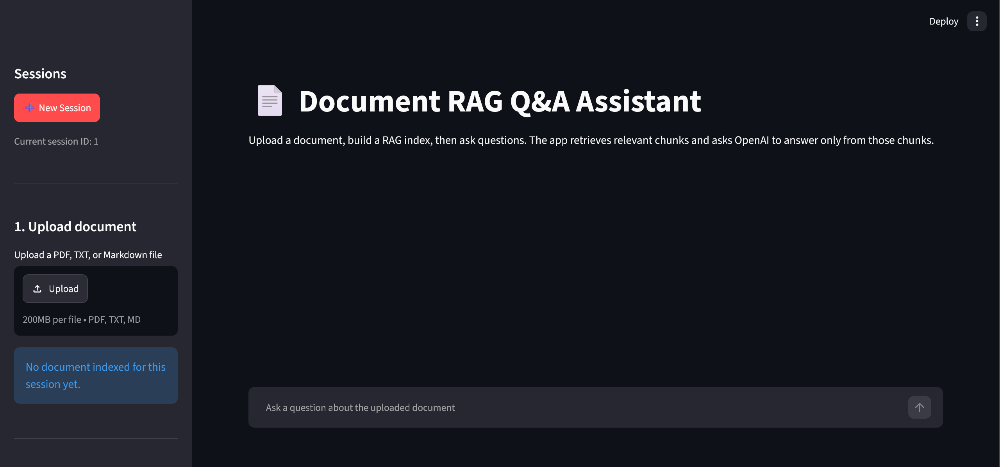

# Document RAG Q&A Assistant


A Streamlit-based Document RAG Q&A application that lets users upload PDF, TXT, or Markdown documents and ask natural-language questions answered from the uploaded document content.



---

## Problem

Long documents can be difficult to search manually, especially when users do not know the exact keyword to search for.

Traditional `Ctrl + F` works for exact word matching, but it cannot understand natural-language questions, summarize related sections, or connect similar ideas written in different wording.

This project helps users such as students, interns, developers, and staff quickly understand lecture notes, reports, resumes, technical handouts, and requirements documents while keeping answers grounded in the uploaded document.

---

## Approach

This project uses **Retrieval-Augmented Generation (RAG)**.

Instead of sending a user question directly to the AI model, the app first searches the uploaded document for relevant chunks. Only the retrieved context is then sent to OpenAI for answer generation.

The pipeline is:

```text
Upload document
→ load PDF/TXT/Markdown
→ split document into chunks
→ create HuggingFace embeddings
→ store chunks in ChromaDB
→ retrieve relevant chunks for the question
→ send retrieved context to OpenAI
→ display answer and retrieved source chunks
```

To improve retrieval reliability, the app includes:

- **Adaptive retrieval** to retrieve more chunks for broad questions.
- **Neighbour chunk expansion** to include nearby chunks when answers are split across chunk boundaries.
- **Same-page expansion** to keep related PDF page content together.
- **Source context display** so users can inspect the retrieved chunks used for each answer.
- **Session management** so different uploaded documents can be kept separate.
- **SQLite persistence** for saved Q&A sessions and chat history.

---

## Tech Stack

| Layer | Technology |
|---|---|
| Language | Python 3.10+ |
| Interface | Streamlit |
| LLM | OpenAI Responses API |
| RAG Framework | LangChain |
| Embeddings | HuggingFace sentence-transformer embeddings |
| Vector Database | ChromaDB |
| Session Database | SQLite |
| Document Loading | PyPDF, TXT, Markdown file handling |
| Environment Management | python-dotenv |
| Version Control | Git and GitHub |

---

## Results

The app was tested on sample PDF documents, including a capstone requirements PDF and a sample resume PDF.

Successful behaviours tested:

- Uploaded a document and automatically built a RAG index.
- Asked questions answered from the uploaded document.
- Returned “I cannot find this in the document” when the answer was not present.
- Displayed retrieved source chunks for transparency.
- Kept different document sessions separate to avoid mixing old and new document chunks.
- Saved Q&A session history using SQLite.

Example successful test questions:

```text
What is the presentation slide structure?
```

```text
What is Alex's education?
```

```text
What is the weather in Singapore today?
```

The third question is intentionally outside the uploaded document and should return that the answer cannot be found in the document.

---

## Setup & Usage

#### Prerequisites

- Python 3.10 or later
- An OpenAI API key
- Git

---

### Installation

Clone or open the project folder:

```bash
cd document_rag_qa_openai
```

Create a virtual environment.

Windows PowerShell:

```bash
py -m venv .venv
.venv\Scripts\activate
```

macOS/Linux:

```bash
python3 -m venv .venv
source .venv/bin/activate
```

Install dependencies:

```bash
pip install -r requirements.txt
```

---

### Environment Variables

Copy `.env.example` to `.env`.

Windows PowerShell:

```bash
copy .env.example .env
```

macOS/Linux:

```bash
cp .env.example .env
```

Edit `.env` and add your OpenAI API key:

```env
OPENAI_API_KEY=your_real_openai_api_key_here
OPENAI_MODEL=gpt-5.4-mini
```

Do not commit your real `.env` file to GitHub.

---

### Run

```bash
streamlit run app.py
```

---

## Usage Examples

### Example 1

Upload the capstone requirements PDF and ask:

```text
What is considered completed for error handling in the capstone project?
```

Expected output:

```text
For error handling, the project is considered complete if it handles errors by showing a clear message when an API call fails or returns nothing, and it does not crash with an unhandled error or exception. This is stated in Chunk 5 / page 3.
```

### Example 2

Ask:

```text
What is the presentation slide structure?
```

Expected output:

```text
The presentation slide structure is:

1. Title — Project name, your name, and one sentence describing what the application does.
2. The Problem — What problem your application addresses, who would use it, and why AI is the right tool for it.
3. How It Works — A simple diagram or a few bullet points showing the flow: user input → your code → AI API → output.
4. Live Demo — No slide is needed; switch directly to your application, show at least two different inputs, and explain what is happening as you go.
5. What You Learned — One thing that was harder than expected and how you worked through it, one thing you would do differently, and one idea for what comes next.

Source: page 5, Chunk 5.
```

### Example 3

Ask a question that is not inside the uploaded document:

```text
What is the weather in Singapore today?
```

Expected output:

```text
I cannot find this in the document.
```

## Project structure
```
document_rag_qa_openai/
├── app.py                     # Streamlit user interface
├── assets/                    # Screenshots for README
│   └── AppUIScreenshot.png    # Screenshot of the App's UI
├── rag_utils.py               # Document loading, chunking, embeddings, retrieval, OpenAI call
├── prompts.py                 # System prompt for grounded document Q&A
├── database/
│   ├── __init__.py
│   └── db_manager.py          # SQLite session and chat history persistence
├── requirements.txt           # Python dependencies
├── README.md                  # Project documentation
├── .env.example               # Example environment variables, no real API key
└── .gitignore                 # Files/folders excluded from Git
```

## Limitations & Future Work

### Limitations

- The app works best with text-based PDFs, TXT, and Markdown files.
- Scanned image-based PDFs may not extract correctly because OCR is not currently implemented.
- Answers depend on retrieved chunks, so missing or incomplete retrieval can affect answer quality.
- Saved sessions store uploaded files and chat history locally, but the app is not designed for secure production use with confidential documents.
- The app may rebuild document indexes when loading saved sessions, so large documents may take longer to reopen.
- The app shows retrieved source chunks, but it does not yet provide fully clickable page references.

### Future Improvements

- Persist each session’s ChromaDB vector index so saved sessions load faster.
- Add optional web search for hybrid document and current-information Q&A.
- Add user feedback to evaluate answer quality and retrieval accuracy.
- Add OCR support for scanned PDFs.
- Add clickable page references that open the cited PDF page.
- Support multiple documents per session.
- Add a local Ollama mode for private or offline document Q&A.
- Add automated evaluation tests to check whether answers are faithful to retrieved context.

## Ethical Considerations

This app is designed to assist document reading, not replace human judgement.

Users should verify important answers using the retrieved source context, especially when working with academic, legal, medical, financial, or confidential documents.

Uploaded documents are stored locally for session history. The app should not be used with sensitive or confidential documents unless proper security, access control, and data handling policies are added.

The app uses an external AI API, so users should avoid uploading private or restricted information unless they understand the data handling implications.

---

## About the Author

**Keith Lua** - [LinkedIn](www.linkedin.com/in/keith-lua) | [Github](https://github.com/keith800x/)

---

## License
[MIT](LICENSE)